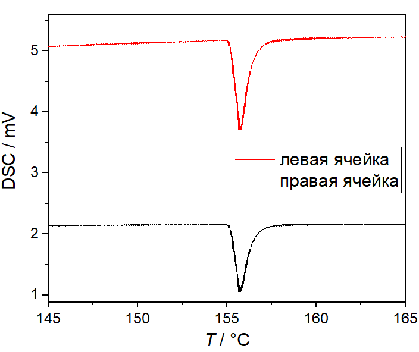
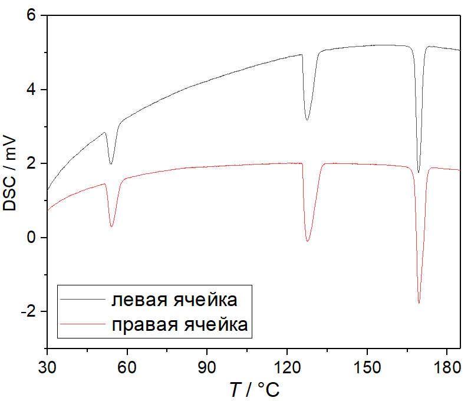
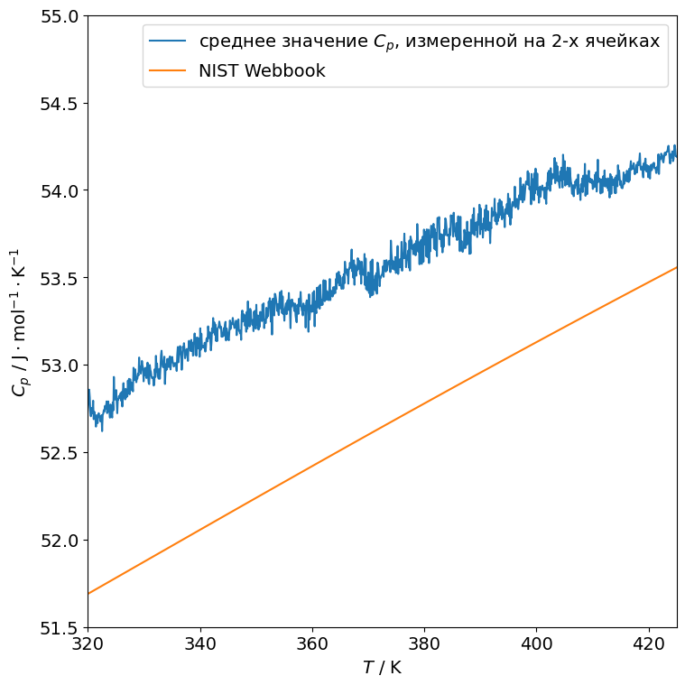
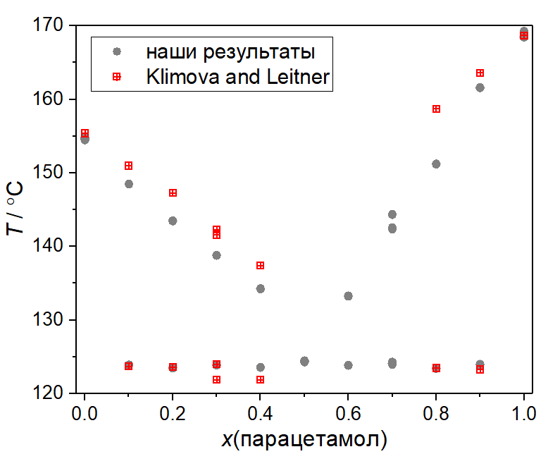

---
hide:
  - navigation
---

# Примеры результатов измерений

## Фазовые переходы

### Плавление In

На рисунке представлены результаты трех последовательных измерений температуры и теплоты плавления металлического индия. Образцы In массой 4.8 мг и 6.0 мг находились в правой и левой измерительных ячейках, соответственно. Измерения проводились в статической атмосфере воздуха, в открытых алюминиевых тиглях, со скоростью нагрева нагревателя 5 K/мин (скорость нагрева измерительных ячеек 3.7 K/мин). Разница между максимальной и минимальной экстраполированной температурой плавления составила 0.1 K, относительная разница площади пика в каждой ячейке - менее 0.7%.

<figure markdown="span">
  { width="500" }<figcaption>Плавление In - фрагменты 3-х кривых ДСК, зарегистрированных в ходе последовательных нагревов</figcaption>
</figure>

### Фазовые переходы в NH4NO3 и использование его для калибровки

Для измерения использовали 15-22 мг нитрата аммония в открытых алюминиевых тиглях.

<figure markdown="span">
  { width="500" }<figcaption>Фазовые переходы в нитрате аммония</figcaption>
</figure>

Картина фазовых переходов в NH4NO3 может быть [достаточно сложна](https://www.chem.msu.ru/cgi-bin/tkv.pl?no=72&joules=1&letter=+&allow_no_ions=&volno=3&pg=0&brutto=NH4NO3&allow_additional_elements=&allow_more_atoms=&tabno=21&show=termodata) и наличие некоторых переходов зависит от предыстории образца, в частности, скорости нагрева и охлаждения из расплавленного состояния, из-за чего [некоторые исследователи](https://doi.org/10.1007/BF02547423) не рекомендуют использовать его в качестве калибровочного материала. Тем не менее, имеющийся у нас образец нитрата аммония при нагреве со скоростью 5 K/мин демонстрирует на кривой ДСК три хорошо различимых пика, соответствующие переходам "IV -> II", "II -> I" и "I -> жидкость". Так как эти фазовые переходы охватывают довольно широкий температурный интервал (практически весь диапазон рабочих температур калориметра), NH4NO3 был бы очень удобен для калибровки.

Мы пробовали использовать NH4NO3 как вторичный стандарт, предварительно измерив "фактические" температуры и теплоты переходов в конкретно этом образце NH4NO3 с помощью Setaram Sensys 830. Было обнаружено, что температурная калибровка слабо зависит от температуры, а тепловая - заметно. Таким образом, измеренная температура корректировалась добавлением постоянной поправки, а площадь фазового перехода пересчитывалась в энтальпию с помощью константы чувствительности, линейно зависящей от температуры. Такая калибровка использовалась для сравнения результатов тепловых эффектов в нескольких неорганических веществах. Как видно из таблицы, получена достаточно хорошая сходимость для температур и теплот фазовых переходов в KNO3 и In. Разница в измеренной на разных калориметрах суммарной теплоте дегидратации BaCl2∙2H2O, осуществляющейся в очень широком диапазоне температур, составила около 5%.

| Вещество | Источник | $T / °C$ | $\Delta H / \mathrm{J \cdot g^{-1}}$ |
|--|--|--|--|
| KNO3 | Колибри | 129.70 ± 0.03 | 49.81 ± 0.32 |
|  | Setaram Sensys | 129.04 | 49.79 |
| BaCl2∙2H2O | Колибри | ≈40-140 | 421.1 |
|  | Setaram Sensys | ≈40-140 | 444.4 |
| In | Колибри | 156.63 ± 0.02 | 28.81 ± 0.07 |
|  | справочные данные | 156.5985 | 28.51 |

## Измерение теплоемкости

Для измерения теплоемкости в качестве образца использовали порошок KCl (>99.99% масс.), а в качестве стандарта - порошок Al2O3 (>99.7% масс.). Порядка 90 мг образца и стандарта запечатывали в алюминиевый тигель. Всего провели три измерения со скоростью нагрева 10 К/мин:

| № | Левая ячейка | Ячейка сравнения | Правая ячейка |
|:--|:-------------|:-----------------|:--------------|
| 1 | пустая       | пустая           | пустая        |
| 2 | KCl | пустая | Al2O3 |
| 3 | Al2O3 | пустая | KCl |

Таким образом, с помощью стандартного (практически в соответствии с [ASTM E1269-11](https://store.astm.org/e1269-11.html)) расчета и известной теплоемкости  [сапфира](https://doi.org/10.6028/jres.087.012) и [алюминия](https://webbook.nist.gov/cgi/cbook.cgi?ID=C7429905&Units=SI&Mask=2#Thermo-Condensed) можно получить зависимости $C_p(T)$ для KCl. Они показаны на рисунке ниже в сравнении со справочными данными ([NIST Webbook](https://webbook.nist.gov/cgi/cbook.cgi?ID=C7447407&Units=SI&Mask=2#Thermo-Condensed)), относительное отклонение от которых во всем температурном диапазоне не превышает 5%.

<figure markdown="span">
  { width="500" }<figcaption>Изобарная теплоемкость KCl</figcaption>
</figure>

## Построение фазовых диаграмм

Пример фазовой диаграммы, которую можно построить с помощью калориметра Калибри, изображен на рисунке ниже в сравнении с [литературными данными](https://doi.org/10.1016/j.tca.2012.09.024). Для этих измерений использовали смеси дегидратированной лимонной кислоты и парацетамола, полученного из медицинского (таблетки) перекристаллизацией из ацетона. Скорость нагрева - 5 К/мин.

<figure markdown="span">
  { width="500" }<figcaption>Фазовая диаграмма системы "лимонная кислота - парацетамол", $x$ - мольная доля парацетамола</figcaption>
</figure>

Некоторые расхождения с литературными данными, скорее всего, обусловлены рядом причин - разными скоростями нагрева, чистотой используемых веществ, атмосферой (наши измерения проводились на воздухе) и природой компонентов. В частности, лимонная кислота весьма склонна к разложению при нагреве, особенно в расплавленном состоянии. К тому же, насколько нам известно, детальных исследований того, в каком состоянии компоненты находятся в расплаве в системе "лимонная кислота - парацетамол" не проводилось, поэтому нельзя сказать, не начинают ли они реагировать и частично разлагаться чуть выше температуры эвтектики (что, безусловно, повлияет на измеренные температуры "ликвидуса").
