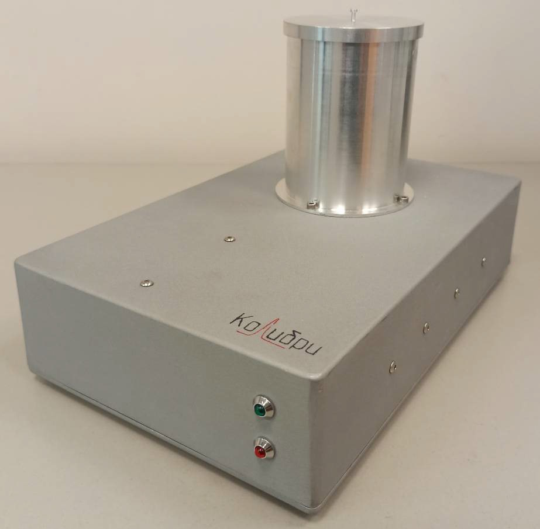

---
hide:
  - navigation
  - toc
---

# О приборе

<figure markdown="span">
  { width="500" }<figcaption>Общий вид калориметра</figcaption>
</figure>

Калориметр дифференциальный сканирующий Колибри – 1.1 
предназначен для проведения термического анализа и измерений термодинамических
характеристик (температура и энтальпия фазовых переходов, теплоемкость) твёрдых,
порошкообразных и жидких материалов, построения диаграмм состояния.

Первые версии калориметра изготавливались для образовательных целей и прошли свои первые испытания в образовательном центре Сириус в ходе [Образовательной программы по термодинамике](https://sochisirius.ru/obuchenie/nauka/smena1751/8857) 6-26 апреля 2024. Затем калориметры использовались для проведения лабораторных работ в рамках общего практикума по физической химии на химическом факультете Уральского федерального университета.

## Описание

Принцип действия калориметра основан на измерении разницы тепловых потоков между
образцом и инертным веществом при равномерном изменении температуры.
Калориметр представляет собой настольный лабораторный прибор, состоящий из
нагревательной печи, калориметрической 3-х-позиционной ячейки, системы охлаждения,
аналого-цифрового преобразователя, совмещенного с усилителем и системой сбора
данных, и работает под управлением внешнего компьютера. Благодаря конструктивным
особенностям 3-х-позиционной калориметрической ячейки возможно одновременное
измерение 2-х образцов относительно одного образца сравнения.