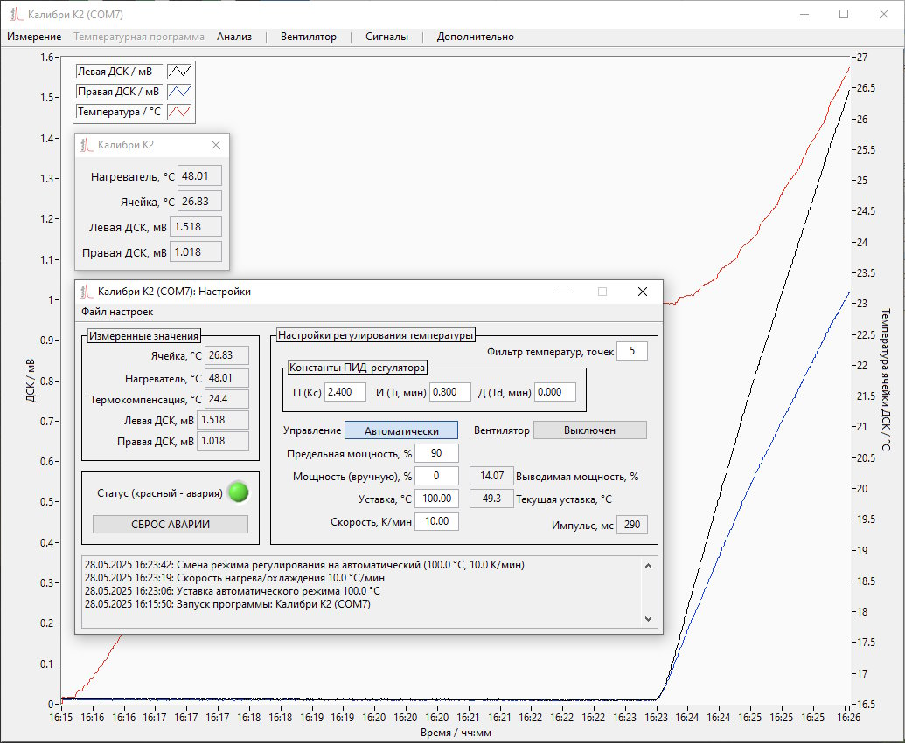
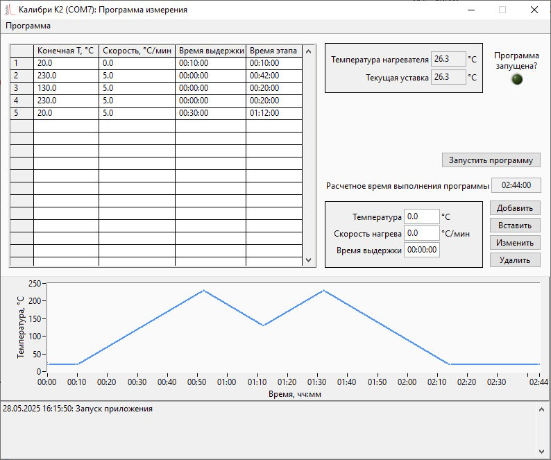
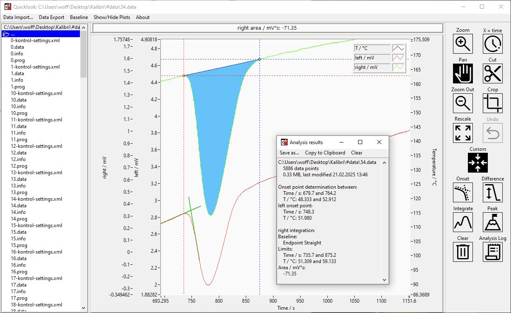

---
hide:
  - navigation
  - toc
---

# ПО

Для управления калориметром и просмотра результатов измерений используются две небольшие программы. Первая предназначена для связи с прибором, управления и сбора данных. В ней предусмотрены возможности ручного управления...

<figure markdown="span">
  { width="500" }<figcaption>Основное приложение с открытыми окнами сигналов и настроек</figcaption>
</figure>

...и автоматического задания температурной программы.

<figure markdown="span">
  { width="500" }<figcaption>Окно задания температурной программы</figcaption>
</figure>

Результаты измерений сохраняются в текстовом (настройки) и бинарном (массивы данных) форматах, которые можно читать и обрабатывать в распространенных программных комплексах для работы с научными данными (мы использовали OriginLab Origin Pro и Python).

Для быстрого просмотра и анализа данных, в т.ч. в ходе текущего эксперимента, предназначено также отдельное приложение. В нем, помимо просмотра измеренных кривых, в упрощенном виде реализованы несколько популярных в анализе ДСК функций, таких, как нахождение площади и экстраполированной температуры начала пика.

<figure markdown="span">
  { width="500" }<figcaption>Приложение для просмотра и анализа данных</figcaption>
</figure>

Для несложных лабораторных работ этого функционала может вполне хватить.

## Системные требования

- ПК с USB-портом
- Windows 7 - 11
- монитор с минимальным разрешением 1024x768